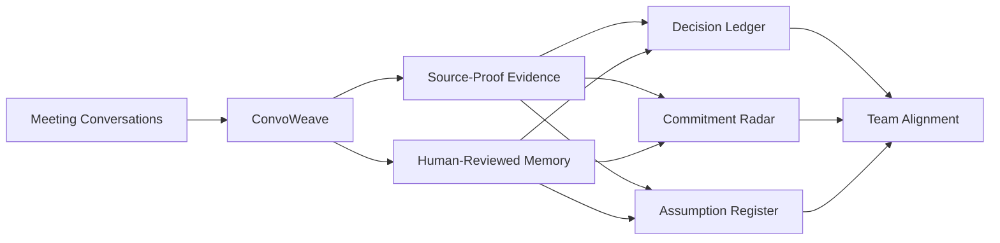
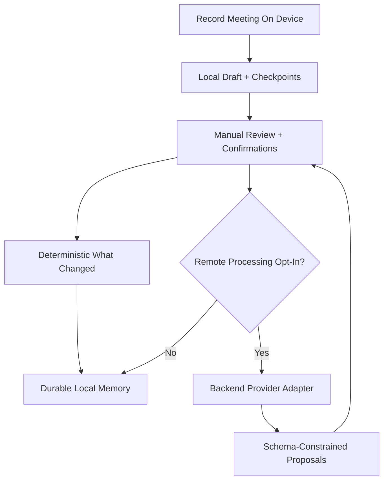

# ConvoWeave

[](https://github.com/drewc611/ConvoWeave/tree/main)
[](https://github.com/drewc611/ConvoWeave/actions/workflows/mobile-ci.yml)
[](https://github.com/drewc611/ConvoWeave/actions/workflows/backend-ci.yml)
[](https://github.com/drewc611/ConvoWeave/actions/workflows/security-ci.yml)
[](https://github.com/drewc611/ConvoWeave/actions/workflows/codeql.yml)
[](https://github.com/drewc611/ConvoWeave/blob/main/LICENSE)
[](#stable-product-on-main)
[](#stable-product-on-main)
[](#architecture-and-product-docs)

**The AI companion that remembers your meetings.**

ConvoWeave is a mobile-first meeting memory and decision system. It preserves what changed across conversations, who committed to what, why decisions were made, which assumptions remain unverified, and where current statements conflict with earlier evidence.

It is intentionally not a transcript-summary app. Raw evidence and generated interpretation remain separate, and important memory keeps source proof.

## Product fit and flow





## Stable product on `main`

The stable product is local-first and usable without any cloud AI provider:

- real on-device microphone capture with explicit permission and recording notice
- pause, resume, stop, duration tracking and interruption handling
- durable recording drafts checkpointed during capture with restart recovery
- SQLite-backed local persistence behind repository interfaces
- persistent meeting threads
- real manual meeting review: paste/type actual notes and add confirmed decisions, commitments and assumptions
- resumable review state
- deterministic per-meeting `What Changed?` change sets
- Decision Ledger with active, disputed, reversed and superseded states
- evidence-backed decision supersede lineage that preserves the prior decision
- Commitment Radar with owner, due date, deterministic risk state and completion/cancellation/reopen
- Assumption Register with supported/disproven/expired transitions
- persisted contradiction review requiring both current and prior evidence
- Private Sidecar notes with an explicit promotion boundary
- reusable Source Proof showing meeting reference, speaker when known, timestamps, segment IDs and quote

Remote processing exists behind a separate backend/client boundary but is not the shipping default.

## Processing platform

The provider-neutral processing platform is now part of `main` and includes:

- explicit development / preview / production configuration
- production startup safety guards
- provider adapter boundaries
- stable request IDs and API error contracts
- liveness/readiness probes
- containerized backend runtime
- dedicated backend CI and live container smoke tests
- environment-safe mobile processing-client selection

Issue #11 records that completed platform slice.

## Current development slice

Issue #13 and `feat/openai-preview-provider-v1` add a real preview-only AI provider behind the existing backend contract. This does not change the local-first shipping default.

The preview adapter currently targets:

- `gpt-transcribe` for uploaded meeting-audio transcription
- `gpt-5.6-luna` for strict schema-constrained structured-memory extraction
- backend-only provider credentials
- `store: false` on extraction responses
- exact transcript-quote validation before provider output becomes a ConvoWeave proposal
- human review before any generated proposal becomes durable meeting memory

Contradiction generation remains excluded from this provider call because ConvoWeave requires both current and prior evidence for a durable contradiction.

Normal CI uses mocked provider responses and requires no external API key. An operator-only live smoke command exists for non-sensitive preview test audio.

See ADR 0002 for provider rationale, limitations, cost/privacy tradeoffs, and the replacement boundary.

## Development

```bash
npm install
npm run typecheck
npm test
npm start
```

For microphone, interruption and restart behavior, validate on a physical device using Expo Go, an Expo development build, or an EAS internal/preview build. Do not treat browser or simulator-only validation as the release gate.

Development process and release promotion rules are documented in `docs/DEVELOPMENT_WORKFLOW.md`.

## Validation

GitHub Actions provide:

- strict TypeScript validation
- Vitest unit and repository restart-state tests
- backend Node contract tests
- backend provider adapter tests with mocked external HTTP
- backend syntax/container/smoke validation when backend code changes
- high-severity dependency audit
- CodeQL JavaScript/TypeScript analysis
- Gitleaks secret scanning
- CycloneDX SBOM generation
- Dependabot for npm and GitHub Actions

The Dependency Review workflow is present but requires GitHub Dependency Graph to be enabled in repository settings.

Physical-device acceptance criteria are in `docs/DEVICE_TEST_PLAN.md` and tracked in Issue #5.

## Architecture and product docs

Read these before changing core behavior:

- `CODEX.md`
- `docs/DEVELOPMENT_WORKFLOW.md`
- `docs/PRODUCT_STRATEGY.md`
- `docs/BACKEND_API.md`
- `docs/adr/0001-runtime-environments-and-provider-boundary.md`
- `docs/adr/0002-openai-preview-processing-provider.md`
- `docs/DEVICE_TEST_PLAN.md`
- `docs/STORE_RELEASE.md`
- `store/PRIVACY_POLICY.md`
- `LICENSE`

Core invariants:

1. Raw evidence is not the same thing as generated memory.
2. Generated proposals require human review before becoming durable memory.
3. Prior decisions are not silently overwritten.
4. A durable contradiction requires evidence from both sides.
5. Unpromoted Private Sidecar notes remain outside shared context.
6. Remote processing is opt-in per meeting.
7. Provider credentials never belong in the mobile bundle.
8. `main` remains the stable/releasable source of truth; feature work enters through reviewed branches.

## Privacy

The stable product keeps audio, reviews and persisted meeting state on device and does not automatically upload meeting audio.

The preview remote-processing path still requires explicit meeting-specific approval before audio can leave the device. `store: false` on a provider request must not be treated as a guarantee of zero provider-side retention. Public distribution with remote processing requires a current provider data-control review plus matching App Store, Google Play and privacy-policy disclosures.

## Release and engineering tracking

- Issue #3: Apple Developer, App Store Connect, Google Play and EAS account-holder steps
- Issue #5: physical iOS/Android device validation
- Issue #11: completed production processing platform v1
- Issue #13: preview AI processing provider v1

Do not commit Apple credentials, App Store Connect keys, Google service-account JSON, Android keystores/passwords, Expo access tokens, provider secrets, recordings, transcripts or user meeting data.

## Proprietary software

Copyright © 2026 Andrew Michael Clark. All rights reserved. See `LICENSE`.
