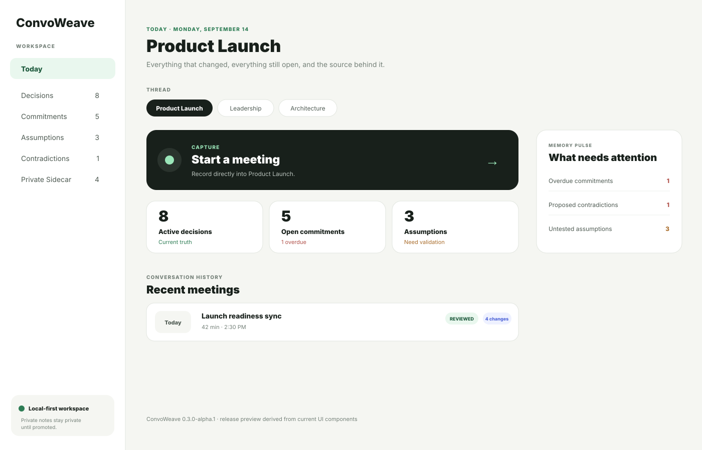
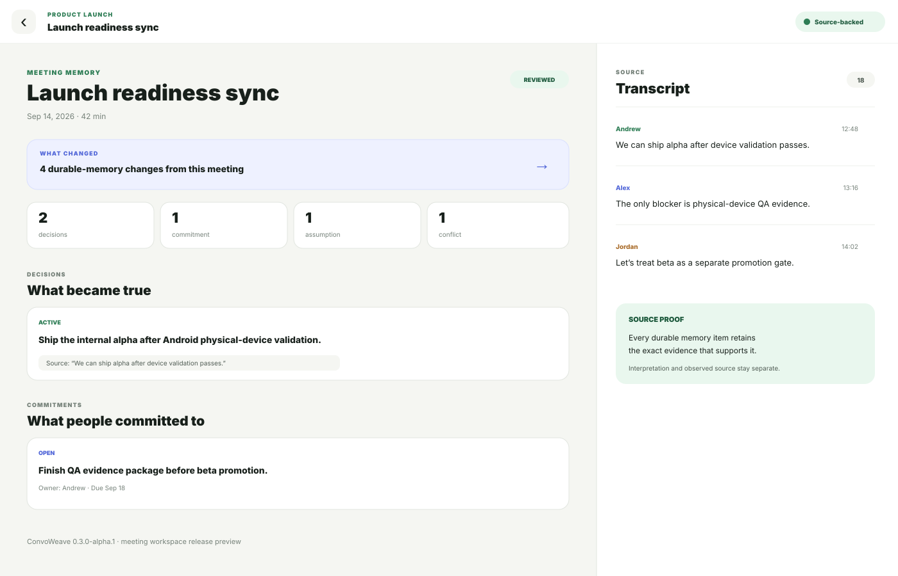
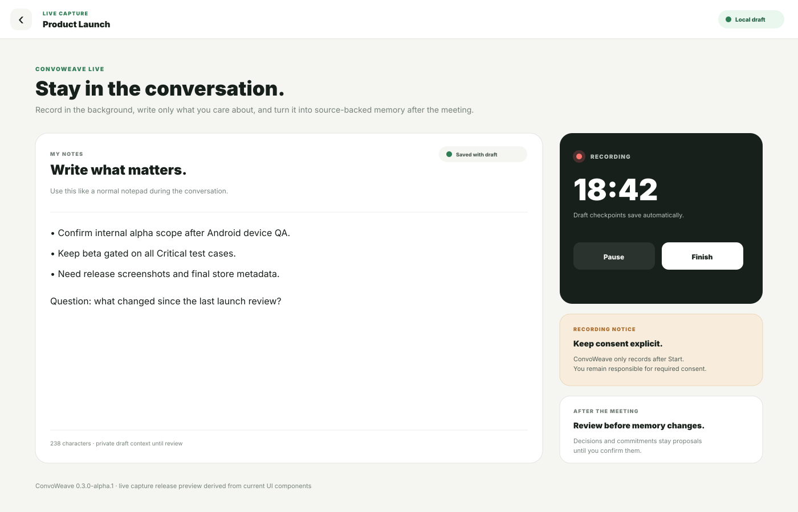

# ConvoWeave UI Preview

These release-preview renders are based directly on the current React Native suite components and theme in `src/features/suite`, `src/features/meetings`, and `src/theme`. They are intended to show the current product experience in GitHub before signed-device screenshots are available.

> These are release-preview renders, not App Store or TestFlight device screenshots. Physical-device screenshots should replace or supplement them after the 0.3.0 alpha device-validation gate passes.

## Suite dashboard

The dashboard is the daily operating surface. It combines a focused Granola-style workspace with the deeper meeting history and operational visibility found in meeting-intelligence products, while making ConvoWeave's durable memory model the primary navigation.

Visible product areas include Today, Decisions, Commitments, Assumptions, Contradictions, Private Sidecar, recent meetings, Memory Pulse, and a direct Start a Meeting entry point.

## Meeting workspace

The meeting workspace uses a source-backed two-pane model. Durable memory stays on the left and the saved transcript/source stays on the right. Users can see what changed, decisions, commitments, assumptions, contradictions, and the exact evidence supporting each important item.

On smaller screens, the same surface becomes separate Memory and Transcript tabs rather than shrinking two panes into an unusable layout.

## Live capture and notepad

Live capture is intentionally not transcript-first. The user gets a clean notepad, visible recording state, automatic draft checkpoints, consent messaging, and a clear post-meeting review boundary.

Typed notes and recording checkpoints survive interruption/restart. Decisions, commitments, and assumptions remain proposals until the user reviews and confirms them.

## Visual system

Current product colors are defined in `src/theme/index.ts`:

- Ink: `#18201B`
- Canvas: `#F5F6F2`
- Paper: `#FFFFFF`
- Forest: `#2E7D55`
- Mint: `#9BE6B9`
- Blue: `#5267D8`
- Amber: `#A96C2A`
- Red: `#B04F48`
- Plum: `#76536E`

The visual direction is quiet, professional, local-first, and evidence-oriented. The design should feel useful during a real meeting rather than visually competing with the conversation.

## Screenshot promotion plan

For `0.3.0-alpha.1`, these preview renders document the current intended UI. After physical-device validation, add actual Android screenshots from the validated build and later add signed iOS/TestFlight screenshots. Never label preview renders as device captures or store screenshots.
